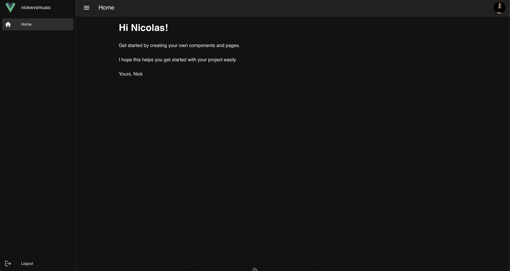

#  SupaNuxt - A Nuxt Supabase Starter Pack
SupaNuxt is your go to starter pack to speed up your development time on your next full-stack web application.

SupaNuxt is based on Vue & Nuxt 3, Pinia, Vuetify, Supabase and Vite. SupaNuxt comes with authentication backed in and provides you with all configurations required to get you started as fast as possible within your next project.


*Please have a look at the [Nuxt 3 documentation](https://nuxt.com/docs/getting-started/introduction) to ensure you follow the most recent best practices on Vue, Nuxt, Pinia, Supabase and Vuetify.*

## Features
- Complete UI based on Vuetify with light and dark mode
- Loading indicators
- Error and success indicators
- Global state using Pinia
- Security and auth proviers backed in: Email, Github and Facebook
- Login Page
- Registration Page
- Example Welcome Page
- User Profile Page
- Password Reset Page
- Applications Setting Page
- Logout functionality

## Technical Stack
- Vite
- Vue 3 / Nuxt 3
- Pinia
- Vuetify
- Supabase

# Screenshots



# Automatic Installation
**IMPORTANT:** The automatic installation was tested on macOS Sonoma only - specific instructions can behave differently on other Unix & Linux distributions. The script will download this repository to your current working directory store it in a new folder called "supanuxt. Please ensure you don't have a ```supanuxt``` folder in your current working directory, to avoid any overrides of your projects!

**Initially make sure to setup your Supabase instance accordingly:**
- Login to https://supabase.com/
- Create a new Supabase project or use an existing project of your choice (in case you are using an existing project, make sure you are not using a table called ```public.profiles``` as well as a storage bucket named ```avatars```, as the script will create those, since they're needed for SupaNuxt)
- Setup your preferred auth providers (Email, Github, Facebook are currently supported within Supanuxt)
- Make sure to save your database password, as we will need it for the automatic installation!

**Now run the following commands in your terminal in your desired location:**
```bash
bash <(curl -Ls https://raw.githubusercontent.com/nicolaswehmeyer/supanuxt/main/install.sh)
```

That's it, you're done!🚀

# Manual installation
**Initially make sure to setup your Supabase instance accordingly:**
- Login to https://supabase.com/
- Create a new Supabase project or use an existing project of your choice (in case you are using an existing project, make sure you are not using a table called ```public.profiles``` as well as a storage bucket named ```avatars```, as the script will create those, since they're needed for SupaNuxt)
- Setup your preferred auth providers (Email, Github, Facebook are currently supported within Supanuxt)
- Rename the ```.env.example``` file to ```.env```
- Insert your projects Supabase URL and API key into the ```.env``` file

Within Supabase, create a new ```public.profiles``` table, enable Row Level Security, create a new RLS policy and add a new bucket to store users profile photos.

*To do this, simply paste the following lines into the SQL editor within your Supabase project and you're done:*
```sql
-- Create a new profiles table to store users profile details
create table public.profiles (
  id uuid primary key references auth.users (id)create table public.profiles (
  id uuid primary key references auth.users (id) default auth.uid(),
  created_at timestamp with time zone default now() not null,
  firstname text,
  lastname text,
  username text,
  street text,
  postcode bigint,
  city text,
  country text,
  photo text
);

-- Enable Row-Level-Security policies
alter table public.profiles enable row level security;

-- Create a new RLS policy enabling authenticated users to CRUD their profiles
create policy "Allow authenticated users to CRUD their own profiles"
  on "public"."profiles" as permissive
  for all
  to authenticated
  using ((auth.uid() = id)) with check ((auth.uid() = id));

-- Create a new public storage bucket to store users profile photos
insert into storage.buckets
  (id, name, public, file_size_limit)
values
  ('avatars', 'avatars', true, 5242880);
```

**Finally, make sure to clone the SupaNuxt repository & install all required dependencies within your projects folder:**
```bash
# Clone the repository
git clone https://github.com/nicolaswehmeyer/supanuxt
# Change directories
cd supanuxt
# yarn
yarn install
```

## Development Server
Start the development server on `http://localhost:3000`:

```bash
# yarn
yarn dev
```

## Production
Build the application for production:

```bash
# yarn
yarn build
```

## Locally preview production build:
```bash
# yarn
yarn preview
```
